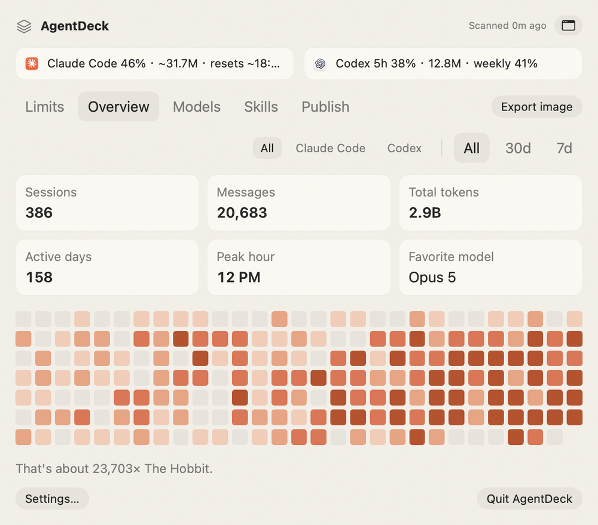
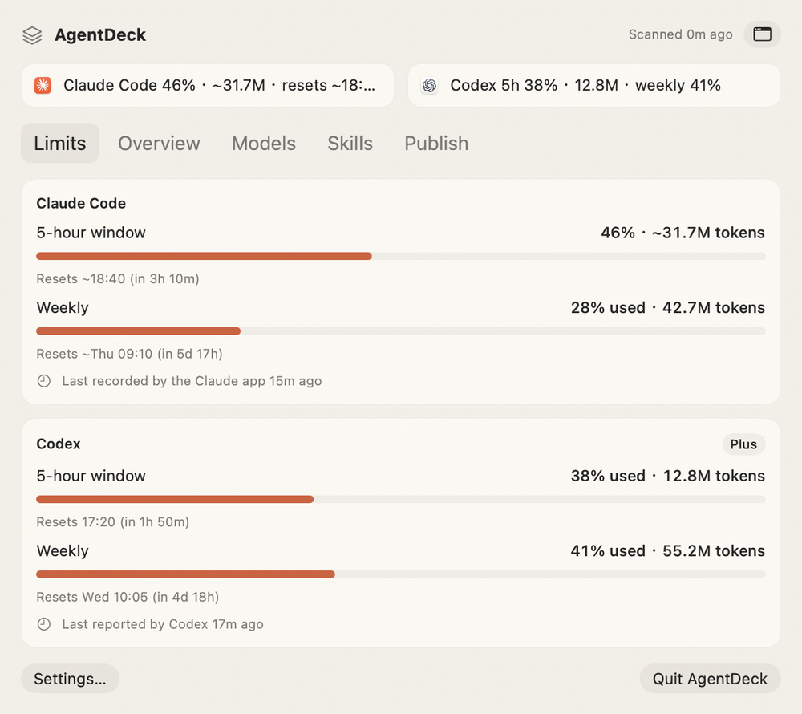
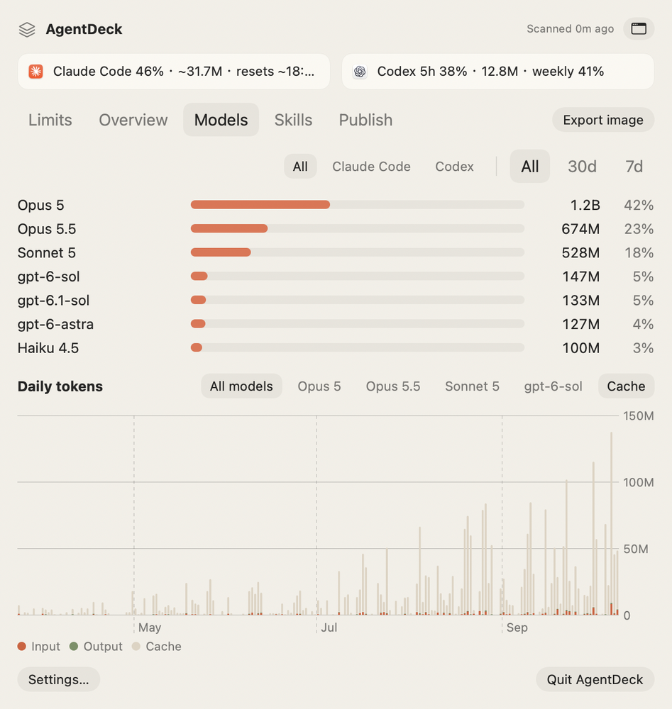
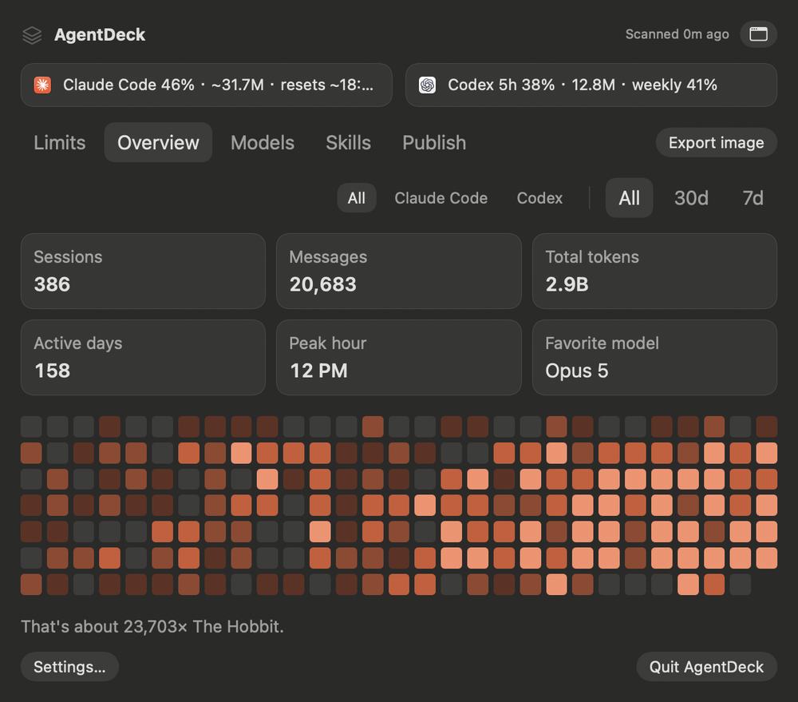
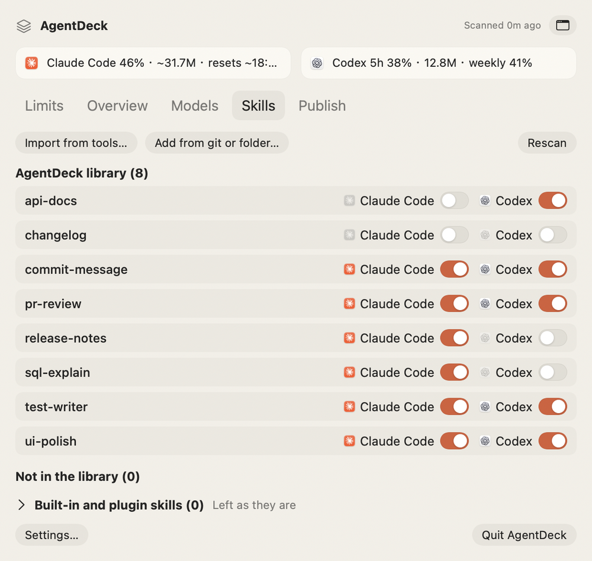
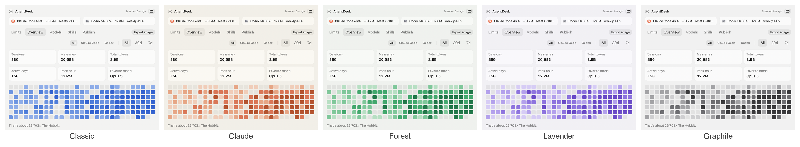
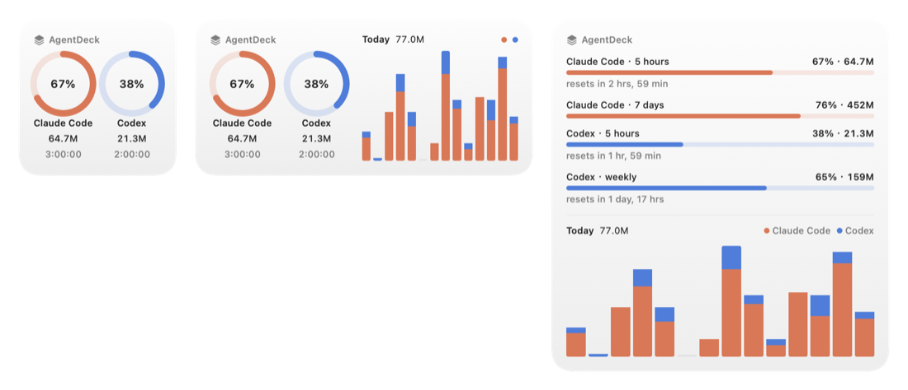
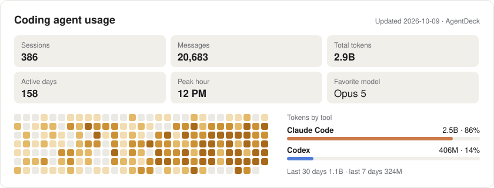

# AgentDeck

A local macOS menu bar app for [Claude Code](https://claude.com/claude-code) and OpenAI
[Codex](https://openai.com/codex): token usage and rate-limit windows at a glance, one library for the
skills both tools load, a desktop widget, and opt-in publishing of aggregate stats to a GitHub profile
or website.

<p align="center">
  
  
</p>

AgentDeck reads the tools' logs read-only and keeps what it parsed in `~/.agentdeck/agentdeck.sqlite`,
so your history survives Claude Code's 30-day transcript cleanup. It sends no telemetry and uses no
undocumented APIs. The only network traffic is `git push` for publishing, and only after you turn it on.

## What it shows

### Limits

Both tools' 5-hour and weekly windows, as a percentage **and** in tokens.

- **Codex** logs its own percentages and reset times, so those are exact (with the time of its last
  report).
- **Claude** percentages come from the Claude desktop app, which records the numbers its usage card
  shows in `~/Library/Application Support/Claude/plan-usage-history.json`. They include use outside
  Claude Code (claude.ai, other devices), and the weekly window's reset is read from when its percentage
  last fell back. The app writes the file only now and then, so the time of its last record is shown.
- **Claude Code** itself logs no limits. Its 5-hour window is estimated from your activity. Without a
  recent percentage from the Claude app, the percentage comes from the times Claude Code stopped you:
  each refusal marks 100%, and the median of the tokens used up to the recent refusals is taken as the
  limit. Where nothing was learned yet, an optional budget from Settings applies.

### Overview and Models

Sessions, messages, total tokens, active days, peak hour and favorite model, a 26-week heatmap, and
tokens per model per day. Filter by tool and by range (All, 30 days, 7 days).

<p align="center">
  
  
</p>

Counting rules are in [DECISIONS.md](DECISIONS.md). In short: every API response is counted once
(Claude Code writes one response as several log lines), so AgentDeck's totals are about half of what
Claude Code's own stats card shows.

### Skills

One library in `~/.agentdeck/skills` (a git repository) for the skills Claude Code and Codex load, with
a switch per tool. Enabling a skill puts a copy into `~/.claude/skills` (the Claude app skips symlinked
skill folders) or a link into `~/.codex/skills`; copies are refreshed when the library changes. Skill
packs such as research-co-pilot show as one row.

<p align="center">
  
</p>

- Import from the tools' folders, a local folder or a git repository. Copies with different content
  are shown side by side with a diff, and you pick one.
- Every change is shown as a plan first. Anything replaced is backed up to `~/.agentdeck/backups` with
  a `RESTORE.txt`; original folders are never deleted, only moved there, and only after you confirm.
- Skills that ship with Codex, plugins or the Claude app are listed but left alone.

### Themes

Five color themes in **Settings › Appearance**: Classic, Claude, Forest, Lavender and Graphite. Each
has a light and a dark variant that follow the system appearance.

<p align="center">
  
</p>

### Desktop widget

Small, medium and large: both tools' 5-hour windows with countdowns, every limit as a bar, and two
weeks of daily tokens. Right-click the desktop, choose **Edit Widgets**, and search for AgentDeck.

<p align="center">
  
</p>

### Publishing (optional, off by default)

A usage card for a GitHub profile README (light and dark), and `data.json` for a website section. Only
aggregates are published: never paths, project names, session IDs, prompts or messages.

<p align="center">
  <picture>
    <source media="(prefers-color-scheme: dark)" srcset="docs/images/card-dark.svg" />
    
  </picture>
</p>

AgentDeck publishes from its own clones in `~/.agentdeck/publish`, never from your working copies.
**Publish now** shows a preview and pushes only when you click Push; the optional daily run prepares
an update and asks, unless you allow it to push on its own.

To show the card on your profile, paste this into your profile repository's README once. AgentDeck only
ever edits between the two markers:

```html
<!-- agentdeck:start -->
<picture>
  <source media="(prefers-color-scheme: dark)" srcset="assets/agentdeck/card-dark.svg" />
  
</picture>
<!-- agentdeck:end -->
```

For a website, copy [`Web/agentdeck/usage.js`](Web/agentdeck/usage.js) and
[`usage.css`](Web/agentdeck/usage.css) into the `agentdeck/` folder where AgentDeck publishes
`data.json`, then add the section to the page:

```html
<link rel="stylesheet" href="agentdeck/usage.css" />
<div id="agentdeck-usage"></div>
<script src="agentdeck/usage.js" defer></script>
```

## Install

Requires macOS 14 or later.

### Download

Get `AgentDeck.zip` from the [latest release](https://github.com/YilongWangBerlin/AgentDeck/releases/latest)
(Apple silicon), unzip it and drag AgentDeck into Applications. The app is signed ad hoc, not
notarized, so the first time you open it macOS says it cannot check the developer: open **System
Settings › Privacy & Security** and click **Open Anyway**. Releases are built by
[a workflow](.github/workflows/release.yml) whenever a `v*` tag is pushed.

### Build from source

Needs Swift 6. The Command Line Tools are enough; Xcode is not needed.

```bash
git clone https://github.com/YilongWangBerlin/AgentDeck.git
```

```bash
cd AgentDeck && scripts/build-app.sh
```

```bash
ditto dist/AgentDeck.app /Applications/AgentDeck.app && open /Applications/AgentDeck.app
```

`build-app.sh` builds the app and the widget extension with SwiftPM and signs both ad hoc for your Mac.
On first launch the dropdown opens under the menu bar icon; opening AgentDeck again from Finder or
Spotlight shows the same content in a resizable window. Settings has **Open at login** and an option
to show the 5-hour usage next to the icon.

If your logs are not in the default places (`~/.claude/projects`, `~/.codex/sessions`), set
`$CLAUDE_CONFIG_DIR` and `$CODEX_HOME` in Settings: apps started from Finder do not see shell variables.

## Command line tools

All read the same data as the app. None of them touches the network.

| Tool | What it does |
|---|---|
| `swift run adparse` | Parses the logs and prints deduplicated totals (`--split` checks incremental parsing) |
| `swift run adingest --db /tmp/test.sqlite` | Scans the logs into a database and prints what changed |
| `swift run adexport --db ~/.agentdeck/agentdeck.sqlite --out data.json --card-light card.svg` | Writes the public `data.json` and the cards, and prints what they contain |
| `swift run adskills list` | Lists every skill, its copies and which tool loads it |
| `swift run adskills import NAME… [--prefer claude\|codex\|agents] [--apply]` | Copies skills into the library; differing copies are taken from the preferred folder |
| `swift run adskills enable NAME… --tool claude\|codex [--move-originals] [--apply]` | Links library skills into a tool's folder |
| `swift run adskills retire PATH… [--apply]` | Moves folders out of the tools' skill folders into the backup |
| `swift run adskills sync [--apply]` | Refreshes Claude Code's copies from the library |

`adskills` prints its plan and changes nothing without `--apply`.

## Development

```bash
swift test
```

The tests use [swift-testing](https://github.com/swiftlang/swift-testing) and synthetic fixtures; real
logs never go into the repository. The screenshots in this README and on the website come from the app
itself, rendered offscreen from made-up data: `scripts/demo-home.py` writes a stand-in home directory
with generated logs, and `--home` makes the renderer read only from there.

```bash
scripts/demo-home.py /tmp/agentdeck-demo
```

```bash
swift build && .build/debug/AgentDeck --render-menu /tmp/limits.png --db /tmp/demo.sqlite --home /tmp/agentdeck-demo --now 2026-10-09T13:30:00Z --limits
```

Without `--home` the renderer reads your own logs, which is handy for checking a layout but not for
anything you publish.

The website is plain HTML in [`docs/`](docs/index.html), served by GitHub Pages from the `docs` folder
of `main`.

Use `--overview` (the default), `--models`, `--skills` or `--publish` for the other tabs, `--dark`
for dark mode, and `--now 2026-10-08T12:30:00Z` to render the menu as it looked at another moment. Run it from the installed app (`/Applications/AgentDeck.app/Contents/MacOS/AgentDeck`)
to get the bundled icons.

| Path | Contents |
|---|---|
| [`Packages/AgentDeckParsing`](Packages/AgentDeckParsing) | Log parsing and deduplication for both tools, with its own tests |
| [`Sources/AgentDeckCore`](Sources/AgentDeckCore) | Database, ingestion and FSEvents, limits, stats, skills library, export, cards, publisher |
| [`Sources/AgentDeck`](Sources/AgentDeck) | The SwiftUI menu bar app |
| [`Sources/AgentDeckWidget`](Sources/AgentDeckWidget) | The WidgetKit extension; it reads only `~/.agentdeck/widget/snapshot.json` |
| [`Web/agentdeck`](Web/agentdeck) | The website section and a full dashboard page |
| [`FORMATS.md`](FORMATS.md) | What the log formats look like, measured on real logs |
| [`DECISIONS.md`](DECISIONS.md) | Every counting rule and design decision, with the reason |
